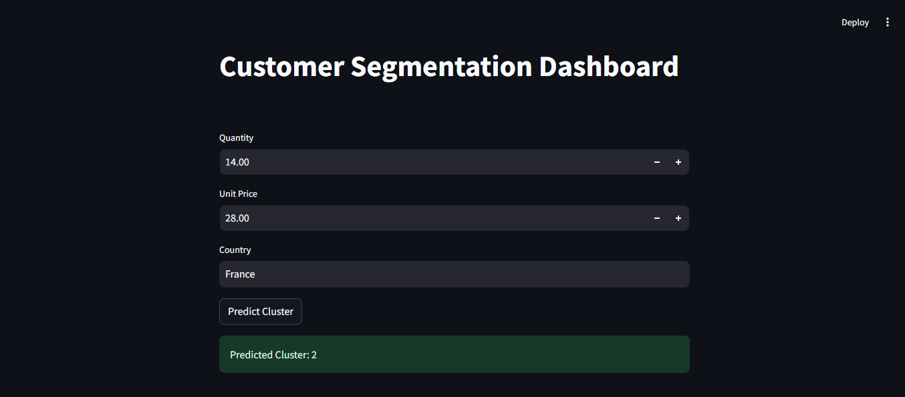

# Customer Segmentation API

This project is a machine learning-based API for customer segmentation, using KMeans clustering. It allows users to enter customer data and receive segment predictions. The project includes preprocessing, model training, a simple Streamlit dashboard for visualizing results, and model deployment using FastAPI.

## Features

- REST API with FastAPI
- Customer segmentation using KMeans
- Model training and preprocessing scripts
- Streamlit dashboard for visualization
- Dockerized for ease of deployment

---

## Prerequisites

1. Python 3.9 or later
2. Docker (for containerized deployment)
3. Git (optional for cloning the repository)

---

## Installation

1. Clone the repository:

   ```bash
   git clone https://github.com/your-username/customer-segmentation.git
   cd customer-segmentation
   ```

2. Install dependencies:

   ```bash
   pip install -r requirements.txt
   ```

---

## Running the API Locally

### Using Uvicorn

Run the FastAPI application:

```bash
uvicorn src.app:app --reload
```

[Access the API documentation](http://127.0.0.1:8000/docs).

---

## Running the Streamlit Dashboard

1. Navigate to the project directory.
2. Run the Streamlit app:
   ```bash
   streamlit run src/app.py
   ```
3. Open your browser and go to [http://localhost:8501](http://localhost:8501).  



---

## Using Docker

### Building the Docker Image

Build the Docker image:

```bash
docker build -t customer-segmentation-app -f deployment/Dockerfile .
```

### Running the Docker Container

Run the container:

```bash
docker run -d -p 8000:8000 customer-segmentation-app
```

[Access the API documentation](http://127.0.0.1:8000/docs).

---

## Deploying the Model with FastAPI

The FastAPI-based model deployment allows you to serve predictions via a REST API. You can interact with the deployed model using tools like Swagger UI or `curl`.

### Steps for Deployment

1. Start the FastAPI application locally:

   ```bash
   uvicorn src.app:app --host 0.0.0.0 --port 8000
   ```

2. Use the Swagger UI at [http://127.0.0.1:8000/docs](http://127.0.0.1:8000/docs) to test endpoints or use the following `curl` command:

   ```bash
   curl -X POST -H "Content-Type: application/json" -d '{"quantity": 10.0, "unit_price": 5.5, "country": "France"}' "http://127.0.0.1:8000/predict"
   ```

For containerized deployment, use the Docker instructions provided above.

---

## Testing the API

This project includes unit tests to ensure the functionality of the API. Tests are written using `pytest`.

### Running Tests

1. Ensure you are in the project root directory.
2. Run the following command to execute all tests:
   ```bash
   pytest tests/test_app.py
   ```
3. The test results will be displayed in the terminal, showing passed and failed tests.


